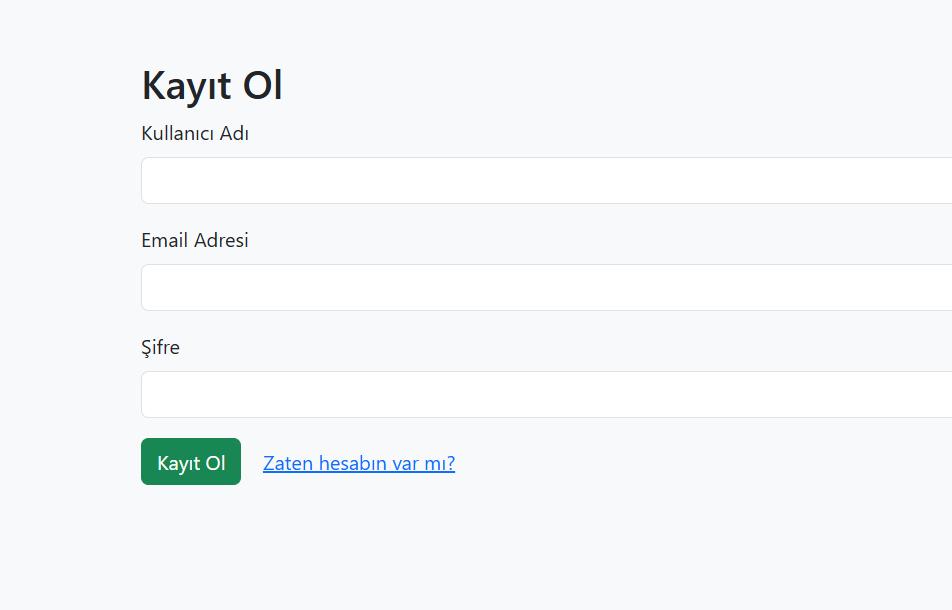

# 🥗 Diyet Takip Sistemi

Bu proje, **PHP**, **MySQL** ve **Bootstrap** kullanılarak geliştirilmiş bir **Web Tabanlı Diyet Takip Uygulamasıdır**.  
Kullanıcılar sisteme kayıt olup giriş yaptıktan sonra günlük öğünlerini kaydedebilir, bu kayıtları listeleyebilir, güncelleyebilir ve silebilir.

---

## 🚀 Kullanılan Teknolojiler

- PHP (Yalın – herhangi bir framework kullanılmadı)
- MySQL veritabanı
- Bootstrap 5 (Responsive arayüz)
- HTML / CSS
- JavaScript (isteğe bağlı)

---

## 🔐 Giriş Sistemi Özellikleri

- Kullanıcı Kaydı (şifre hash'li)
- Şifreli Giriş
- Oturum Yönetimi (PHP Sessions ile)
- Güvenli çıkış (logout)

---

## 🧾 Diyet Kayıt Özellikleri (CRUD)

- 🟢 Yeni diyet kaydı ekleme (Tarih, öğün, içerik, kalori, not)
- 🟡 Var olan kaydı düzenleme
- 🔴 Kayıt silme (kendi verisini silebilir)
- 📄 Tüm kayıtları tablo halinde listeleme

---

## 📸 Ekran Görüntüleri

### 👤– Kayıt Ol Ekranı

`register.php` sayfası. Kullanıcı adı, e-posta ve şifre girerek hesap oluşturma bölümü.

### 🔐- Giriş Ekranı

`login.php` sayfası. Kullanıcı e-posta ve şifre ile sisteme giriş yapar.

### 🏠– Dashboard (Hoş Geldin Sayfası)

`dashboard.php`. Kullanıcıya özel hoş geldin mesajı ve yönlendirme butonları.

### 📝– Diyet Kayıt Listesi

`diyet_listele.php`. Kayıtlı öğünleri tablo olarak görür. Sil ve düzenle butonları yer alır.

### ➕– Yeni Kayıt Ekleme Sayfası

`diyet_ekle.php`. Form üzerinden yeni öğün bilgisi eklenebilir.

### ✏️– Kayıt Güncelleme Ekranı

`diyet_duzenle.php`. Önceden eklenmiş kayıtlar güncellenebilir.

---

## 🎬 Tanıtım Videosu

📽️ [Tanıtım videosunu izlemek için tıklayın](https://drive.google.com/...)  
> Videoda: Kayıt ol, giriş yap, kayıt ekle, düzenle, sil, çıkış işlemleri sırayla gösterilmiştir.

---

## 📁 AI.md Hakkında

Yapay zeka desteğiyle proje geliştirilmişse, tüm konuşmalar `AI.md` dosyasında kayıtlıdır.

---

## 🌐 Canlı Demo

Proje, verilen hosting alanında aktif olarak çalışmaktadır:  
🔗 <a href="http://95.130.171.20/~st23360859084/diyet-takip/">href="http://95.130.171.20/~st23360859084/diyet-takip/</a>

---

## 🛡️ Güvenlik Notları

- Şifreler `password_hash()` ile saklanır.
- Oturumlar `$_SESSION` ile yönetilir.
- `db.php` dosyasındaki özel bilgiler GitHub versiyonunda maskelenmiştir.

---

## 🧠 Geliştirici

**Ad Soyad:** [Furkan BULDUKLU]  
**Okul No:** [23360859084]  
**Ders:** Web Tabanlı Programlama  
**Dönem:** Bahar 2025  
